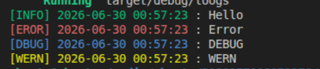

# LoOgs

**LoOgs**はRustプロジェクトでデバッグやログ、エラーを日時と分かりやすく出力するためのクレートです。

## インストール

プロジェクトにLoOgsを追加するために以下のコマンドを実行してください。
```cargo
cargo add loogs
```
または
`Cargo.toml`の`dependencies`に以下を追加
```toml
[dependencies]
loogs = "1.0.4"
```

## ドキュメント
まず、利用する場所で`use`しないといけません。
```rust
use loogs;
```

**LoOgs**には4つのマクロがあります。

### INFO
これは通常の`println!`や`print`と同じ動作をします。
```rust
loogs::info!("Hello");
```
出力例は以下です。
```ini
[INFO] 2026-06-30 00:57:23 : Hello
```

### ERROR
これはエラー時の出力に用いられます。
```rust
loogs::err!("Error");
```
出力例は以下です。
```ini
[EROR] 2026-06-30 00:57:23 : Error
```

### WERN
これは警告などを行う際に用いられます。
```rust
loogs::wern!("WERN");
```
出力例は以下です。
```ini
[WERN] 2026-06-30 00:57:23 : WERN
```

### DEBUG
デバッグ出力を行う際に用いられます。
```rust
loogs::debug!("DEBUBG");
```
出力例は以下です。
```ini
[DBUG] 2026-06-30 00:57:23 : DEBUG
```

## スクリーンショット
出力は出力レベルに応じて色分けされます。</br>
